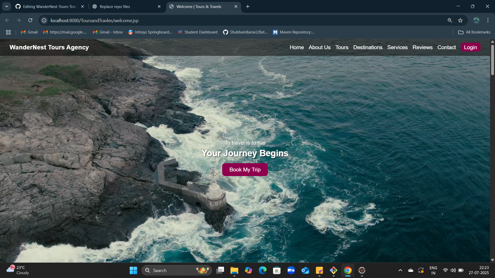
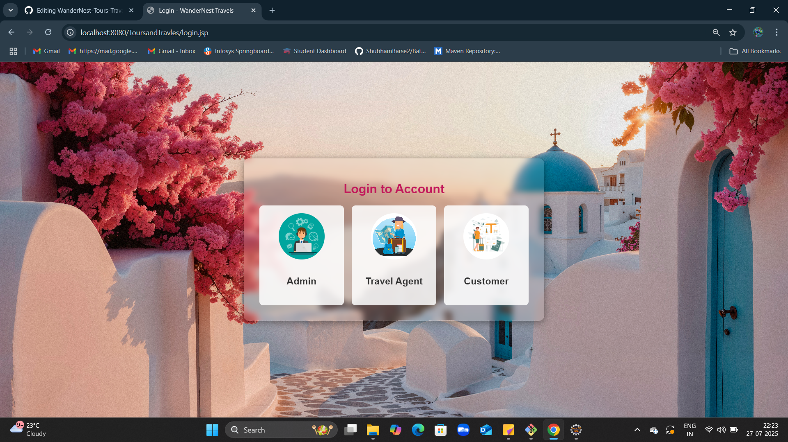
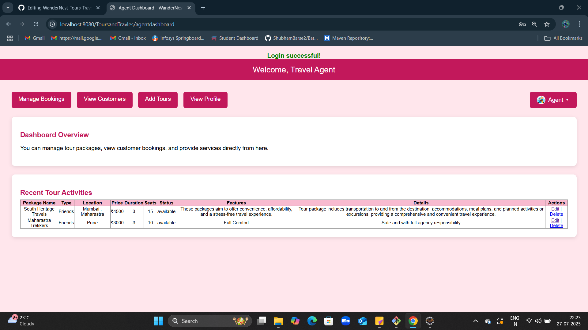
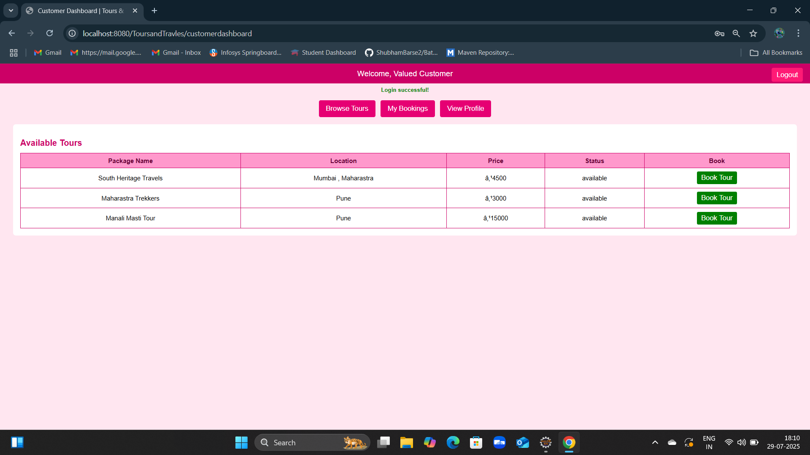

# 🌍 WanderNest Agency - Tours & Travels System 🧳

A dynamic and responsive **Travel Booking Web Application** built using **JSP**, **Servlets**, **JDBC**, and **MySQL**. WanderNest simplifies travel management for **Admins**, **Travel Agents**, and **Customers** in a single platform.

---

## 🚀 Features

### 👤 Admin Panel (Optional)
- View and manage all customers and travel agents
- Approve or reject agent registrations
- View all bookings and tours
- Monitor activity across the system

### 🧑‍💼 Travel Agent Dashboard
- Register/Login as an agent
- Add new tour packages
- View, edit, and delete own tours
- View bookings received from customers

### 🧳 Customer Portal
- Register/Login as a customer
- Browse available tour packages
- Book tours instantly
- View booking history
- Cancel existing bookings
- Edit profile

---

## 🛠️ Technologies Used

- **Frontend:** HTML, CSS, JavaScript
- **Backend:** JSP, Servlet (Jakarta EE)
- **Database:** MySQL
- **JDBC** for database connectivity
- **Apache Tomcat** as the server

---

## 🗂️ Project Structure

```
WanderNest/
│
├── src/
│ ├── com.admin/ → Admin Servlets
│ ├── com.agent/ → Agent Servlets
│ ├── com.customer/ → Customer Servlets
│ ├── com.model/ → JavaBeans (Tour, Booking, User etc.)
│
├── webapp/
│ ├──  → Admin JSP pages
│ ├──  → Agent JSP pages
│ ├──  → Customer JSP pages
│ ├──  welcome.jsp → Homepage
│ ├──  META-INF
│ └──  WEB-INF
│        └── lib / → MySQL connector jar  
│
└── README.md → Project documentation
```

📸 Screenshots

## 📸 Application Screenshots

### 🏠 Homepage  


### 🔐 Login Page  


### 🧑‍💼 Agent Dashboard  


### 🧳 Customer Dashboard  


